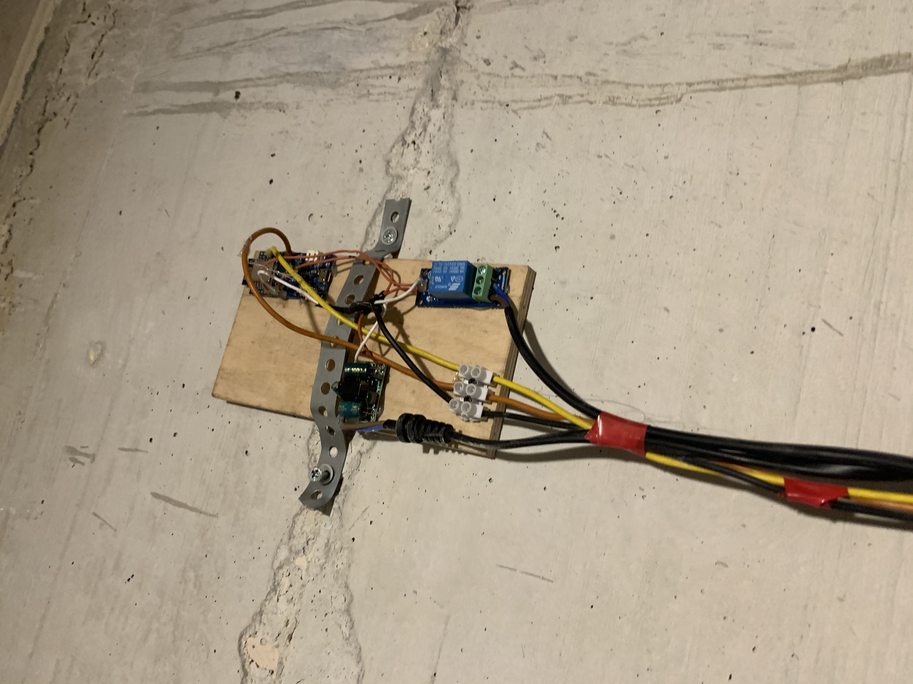
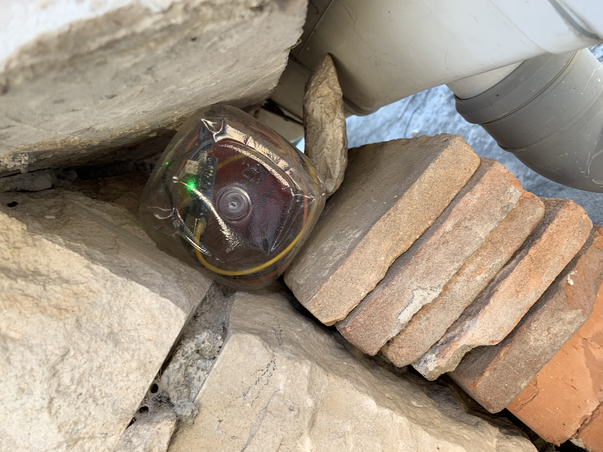

# Solar-collector-pump-control
# Upravljanje pumpom za solarni kolektor 

Two arduino microcontrollers are controlling the pump that pushes water from a solar collector to a boiler located away from the solar collector. Such a solution was not possible to achieve with a classic thermostat because information on the temperature difference between the boiler and the collector is required to control the pump.  The pump works when the desired temperature difference is achieved between the collector and the boiler, wich user can modify in the system application interface. The user has an insight into the historical representation of the data in the diagram, therefore he can see exactly what was the temperature movement in the boiler and collector and when the pump was running.  Also user on the application interface can switch off the automatic operation itself and start the pump "manually".

It consists of two subsystems, or two microcontrollers esp8266 and two temperature sensors (one in the boiler, the other in the solar panel), two voltage suply and relay for pump driving.  Subsystems exchange temperature data with client-server method and comparing them, after it is desired temperature difference is achieved (the user can unijent through blynk applications ) the relay to which the pump is connected is switched on and the heated water from the solar collector goes to the boiler.

Sastoji se od dva podsustava. Odnosno dva mikroupravljača esp8266 te dva senzora temperature (jedan u bojleru, drugi u solarnoj ploči ) šalju podatke o temperaturi client-server metodom te ih uspoređuju, kad se ostvari željena razlika temperature(koju korisnik može unijent preko blynk aplikacije) relej na koji je spojena  pumpa se pali te zagrijana voda iz solarnog kolektora ide u bojler. 

1. The subsystem 1. ESP8266 installed in the boiler consists of the power supply, the relay that controls the pump, and the temperature sensor that is installed in the boiler.
 
1.	Podsustav ESP8266 smješten je kod solarnog kolektora sastoji se od napajanja, senzora temperature  ima funkciju za slanje podatka o temperaturi na podsustav 1, klijent server metodom.

2. Other subsystem 2.ESP8266 is located near the solar collector it consists of power supply and temperature sensor. His function is to send temperature data to subsystem 1, with client server method.

3. Operation of the microcontroller
The microcontrollers communicate on the local network using the client-server method, and in the event of being left without the Internet, they continue to work. In the event of a local mains failure or in the event that the collector temperature data does not reach the microcontroller at the boiler, the pump does not run in order to avoid scenarios of the pump remaining running in the event of a mains failure.

3.	Odrađivanje mikrokontrolera
Mikrokonroleri komuniciraju na lokalnoj mreži klijent-server metodom, u slučaju ostanka bez interneta nastavljaju s radom. U slučaju pada lokalne mreže ili u slučaju da ne dođe podatak o temperaturi u kolektoru do mikrokontrolera kod bojlera pumpa ne odrađuje ne bi li se izbjegli scenariji da pumpa ostane raditi u slučaju pada mreže.  

4. Blynk application
Through the Blynk application in the "Readings" tab, the user has an insight into the historical temperature display in the boiler and in the solar collector also has a display of when and how much and at what temperatures the pump was running. It also has information about the wifi signals of each subsystem.
 
4.	Blynk aplikacija
Putem Blynk aplikacije  u tab-u „Očitanja“ korisnik ima uvid u povijesni prikaz temperature u bojleru te u solarnom kolektoru također ima prikaz  kad i koliko i prikojim temperaturama je pumpa radila.  Također ima informaciju o wifi signala pojedinog podsustava.

