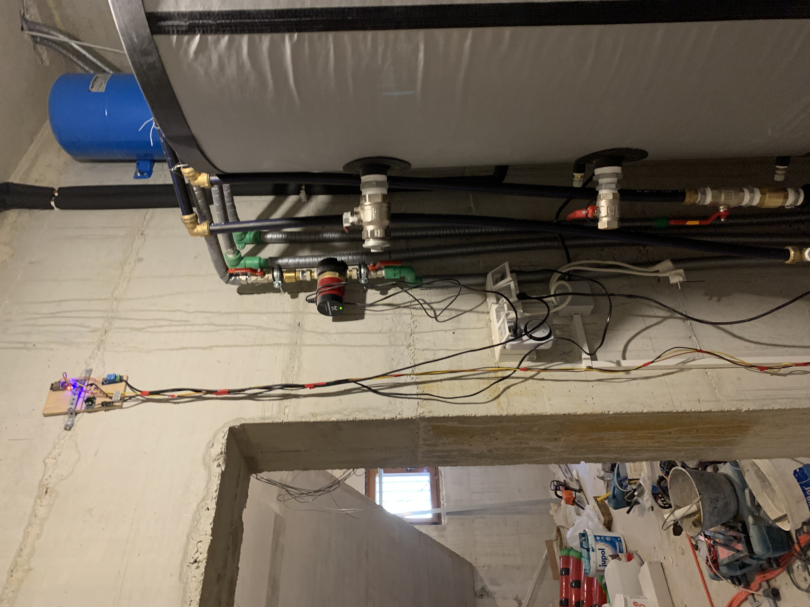

# Solar-collector-pump-control
# Upravljanje pumpom za solarni kolektor 

Two arduino microcontrollers are controlling the pump that pushes water from a solar collector to a boiler located away from the solar collector. Such a solution was not possible to achieve with a classic thermostat because information on the temperature difference between the boiler and the collector is required to control the pump.  The pump works when the desired temperature difference is achieved between the collector and the boiler, wich user can modify in the system application interface. The user has an insight into the historical representation of the data in the diagram, therefore he can see exactly what was the temperature movement in the boiler and collector and when the pump was running.  Also user on the application interface can switch off the automatic operation itself and start the pump "manually".

